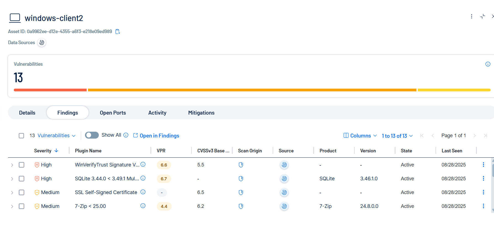
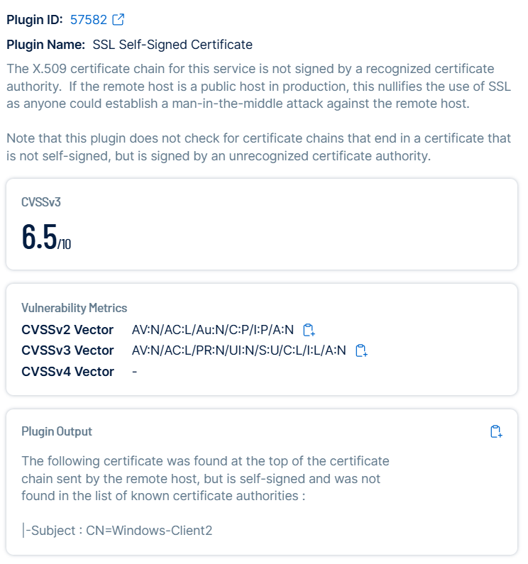

# STIG – SSL Self-Signed Certificate (Plugin ID: 57582)

## Before
- Finding: System is using a self-signed SSL certificate (CN=Windows-Client2).
- Risk: Certificate not trusted by a recognized Certificate Authority (CA).
- Evidence:  

  
  

## Remediation
- Replace the self-signed certificate with one issued by a trusted CA.
- Options:  
  1. Public CA (Let’s Encrypt, DigiCert, etc.)  
  2. Enterprise CA (Active Directory Certificate Services).  
- Verify the new certificate chain using browser or certutil.

## After Remediation
(Placeholder – will add screenshots once fixed and rescanned)

- Confirm Tenable no longer reports plugin ID 57582.
- Proof: Updated Tenable scan screenshot (to be added).
- Proof: Updated certificate details screenshot (to be added).

